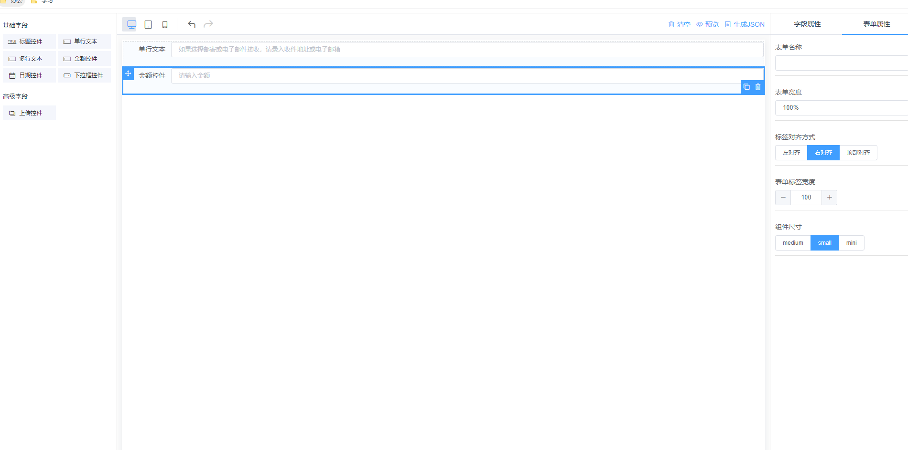
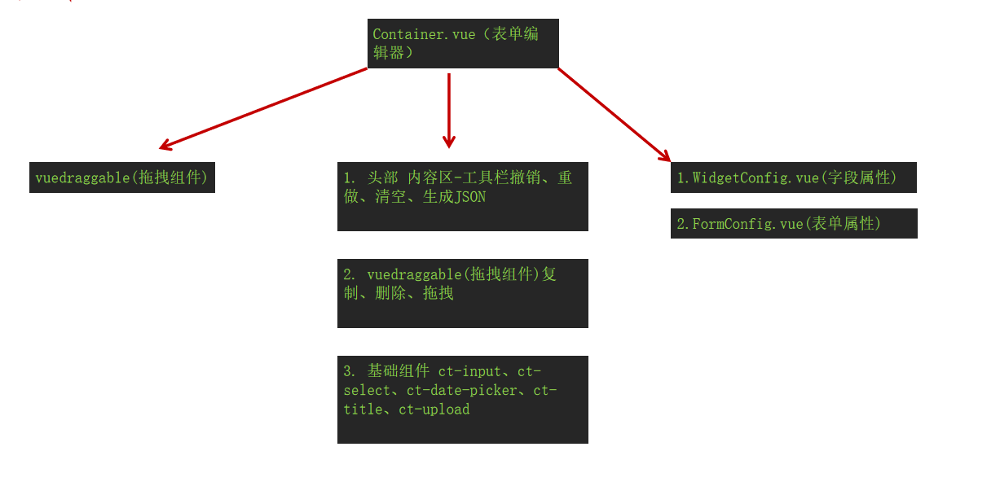
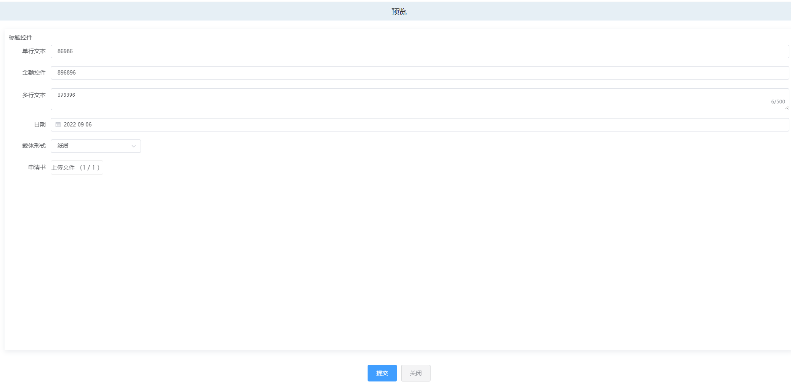
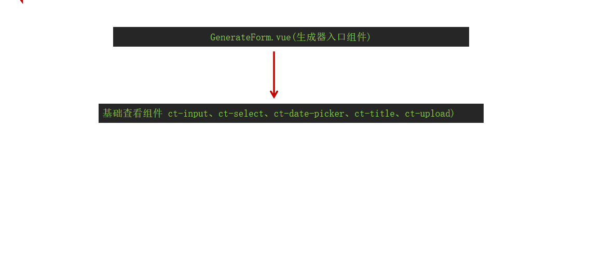

[[toc]]
### 1. 项目背景
::: danger
* 自定义组件模块再多项目中落地（申报、附院），同一套代码多项目中维护，自定义组件有需求变动，造成多项目中的自定义组件不同 维护成本变大。
* 模板由产品、测试编写.Excel文件由后端导入，经常缺少必要字段，需要前后端人员查找原因，浪费人力成本、时间成本，缺少可视化页面，对维护模板人员不友好
* 自定义组件缺少统一维护地址
* 无法体现前端工作产出
:::


### 2. 什么是低代码？
> * 低代码是无需编码（0 代码）或通过少量代码就可以快速生成应用程序的开发平台。
> * 通过可视化进行应用程序开发的方法，使用拖拽组件和模型驱动的逻辑来创建网页和移动应用程序。

### 3. 低代码的核心能力
> * 可视化开发
> * 数据模型驱动
> * 扩展性
> * 工程化

### 4. 市场调研
#### [FormGenerator](https://mrhj.gitee.io/form-generator/#/)
#### 优点
> * 功能齐全
> * 数据模型驱动
#### 缺点
> * 扩展性弱，不易于多人维护
> * 开发成本高

```js
import { deepClone } from '@/utils/index'

const componentChild = {}
/**
 * 将./slots中的文件挂载到对象componentChild上
 * 文件名为key，对应JSON配置中的__config__.tag
 * 文件内容为value，解析JSON配置中的__slot__
 */
const slotsFiles = require.context('./slots', false, /\.js$/)
const keys = slotsFiles.keys() || []
keys.forEach(key => {
  const tag = key.replace(/^\.\/(.*)\.\w+$/, '$1')
  const value = slotsFiles(key).default
  componentChild[tag] = value
})

function vModel(dataObject, defaultValue) {
  dataObject.props.value = defaultValue

  dataObject.on.input = val => {
    this.$emit('input', val)
  }
}

function mountSlotFlies(h, confClone, children) {
  const childObjs = componentChild[confClone.__config__.tag]
  if (childObjs) {
    Object.keys(childObjs).forEach(key => {
      const childFunc = childObjs[key]
      if (confClone.__slot__ && confClone.__slot__[key]) {
        children.push(childFunc(h, confClone, key))
      }
    })
  }
}

function emitEvents(confClone) {
  ['on', 'nativeOn'].forEach(attr => {
    const eventKeyList = Object.keys(confClone[attr] || {})
    eventKeyList.forEach(key => {
      const val = confClone[attr][key]
      if (typeof val === 'string') {
        confClone[attr][key] = event => this.$emit(val, event)
      }
    })
  })
}

function buildDataObject(confClone, dataObject) {
  Object.keys(confClone).forEach(key => {
    const val = confClone[key]
    if (key === '__vModel__') {
      vModel.call(this, dataObject, confClone.__config__.defaultValue)
    } else if (dataObject[key]) {
      dataObject[key] = { ...dataObject[key], ...val }
    } else {
      dataObject.attrs[key] = val
    }
  })

  // 清理属性
  clearAttrs(dataObject)
}

function clearAttrs(dataObject) {
  delete dataObject.attrs.__config__
  delete dataObject.attrs.__slot__
  delete dataObject.attrs.__methods__
}

function makeDataObject() {
  return {
    attrs: {},
    props: {},
    nativeOn: {},
    on: {},
    style: {}
  }
}

export default {
  props: {
    conf: {
      type: Object,
      required: true
    }
  },
  render(h) {
    const dataObject = makeDataObject()
    const confClone = deepClone(this.conf)
    const children = []

    // 如果slots文件夹存在与当前tag同名的文件，则执行文件中的代码
    mountSlotFlies.call(this, h, confClone, children)

    // 将字符串类型的事件，发送为消息
    emitEvents.call(this, confClone)

    // 将json表单配置转化为vue render可以识别的 “数据对象（dataObject）”
    buildDataObject.call(this, confClone, dataObject)

    return h(this.conf.__config__.tag, dataObject, children)
  }
}

```
#### 优点
> * 功能齐全，可扩展性强
> * 易维护，易上手
> * 扩展性强
#### 缺点
> * 代码存在冗余
#### [FormMarking](http://docs.form.making.link/manual/start.html)

#### [12个 yyds 的低代码开源项目](https://mp.weixin.qq.com/s/2pTDHCQPtnta3I1njPN3iw)

### 5. 一期目标
> * 梳理原有数据结构，建立组件数据模型
> * 通过可视化界面实现现有项目【申报、附院联动】自定义组件
> * 已组件形式部署到华宇npm组件库中，在业务系统中引入使用

### 6. 方案设计
::: tip
* 框架: vue2 + elementUI + axios + vueDraggable + monaco-vue-demo
* vueDraggable 拖拽组件 [https://www.itxst.com/vue-draggable/tutorial.html](https://www.itxst.com/vue-draggable/tutorial.html)
* monaco-vue-demo 编辑器 [https://github.com/JakHuang/monaco-vue-demo](https://github.com/JakHuang/monaco-vue-demo)
* 对外抛出两个组件 1. 表单编辑器 2. 表单生成器
:::
#### 表单编辑器


#### 表单生成器


``` text
// 运行项目
npm run serve

// 打包设计器
// "build-bundle": "vue-cli-service build --target lib --name FormMaking ./src/index.js",
npm run build-bundle

// 登录公司组件库地址
npm adduser --registry http://npm.thunisoft.com/

// 发布组件
npm publish --registry http://npm.thunisoft.com/

// 在项目中更新最新依赖包
npn install @com.thunisoft.9law@版本号 --save

// 重新启动
npm run serve
```

