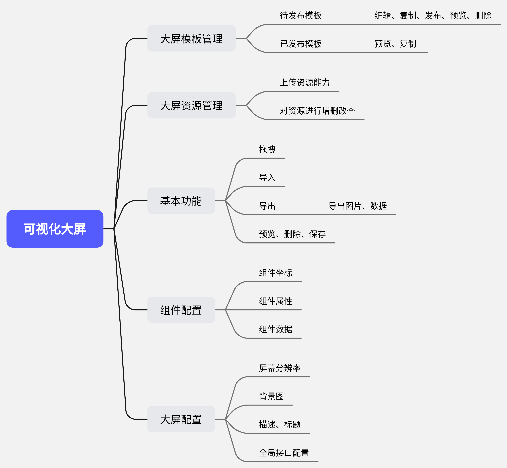

[[toc]]
### 1. 项目背景
::: danger
* 目前每个项目的大屏是一个独立的前端项目、每次都由开发人员进行定制化开发
* 多个前端项目，不利于对大屏项目进行统一的管理与维护
* 经调研大屏可视化项目中组件多有可复用的重复组件、布局、样式, 可以进行抽离，避免重复开发
* 决定产出可视化大屏拖拽生成工具，并对大屏模板、资源进行统一管理
:::

### 2. 可视化大屏实现目标
> #### 2.1 项目管理
> #### 模板管理(关联项目，确保数据与组件匹配)
> #### 资源管理(管理静态资源，如图片)
> #### 数据接口管理(在组建属性内进行接口选择，而非手动输入)

### 3. 可视化大屏功能模块

