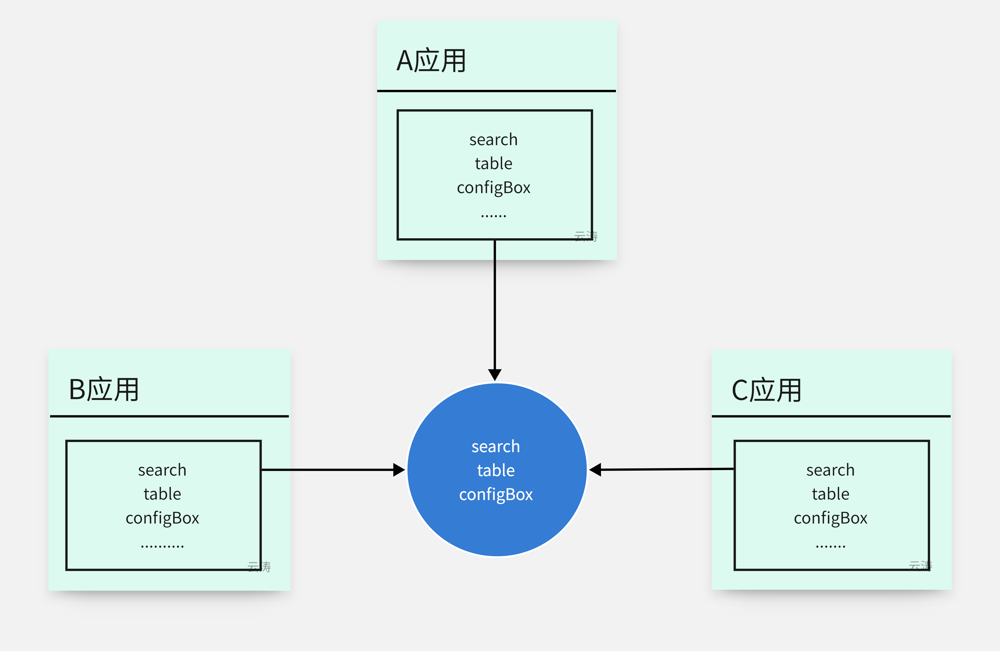
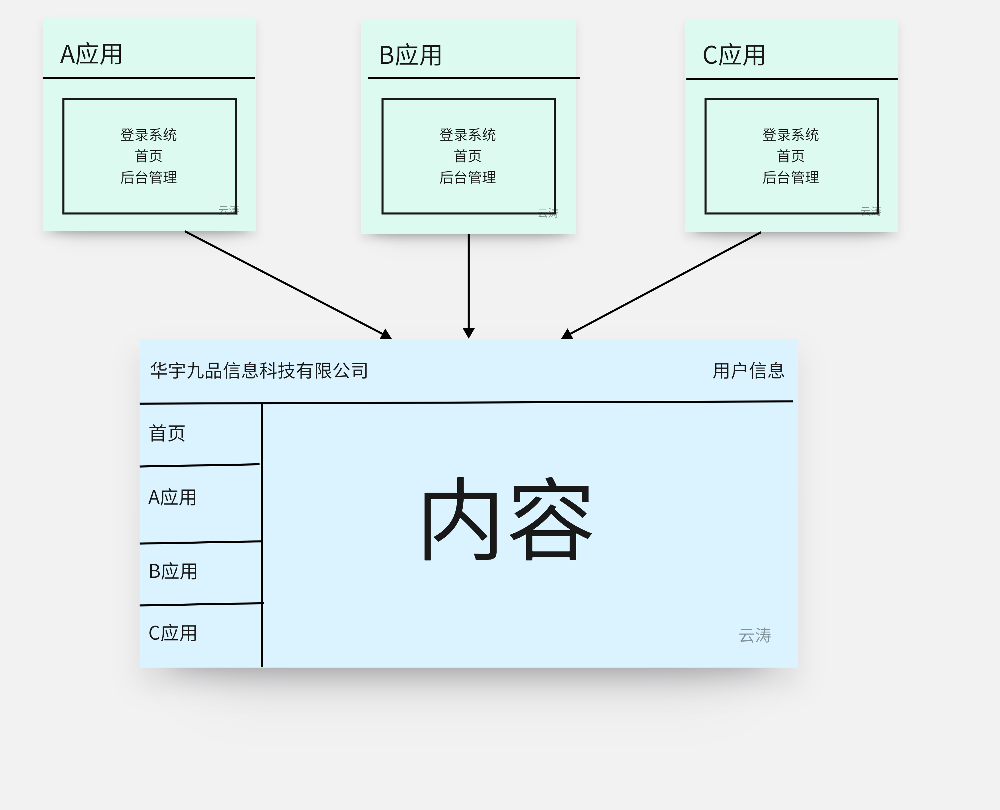
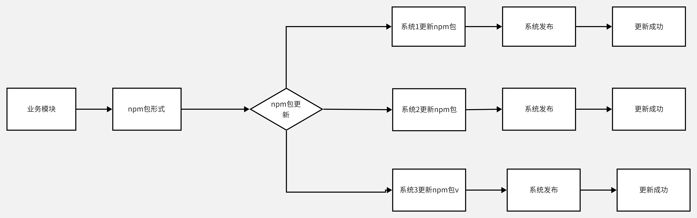
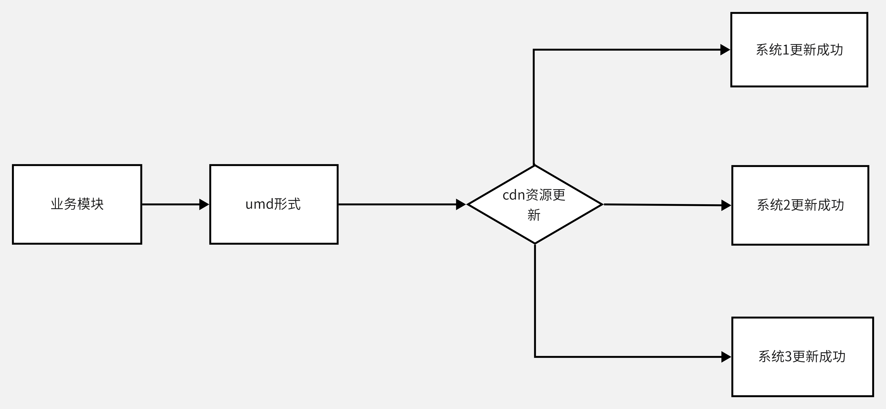
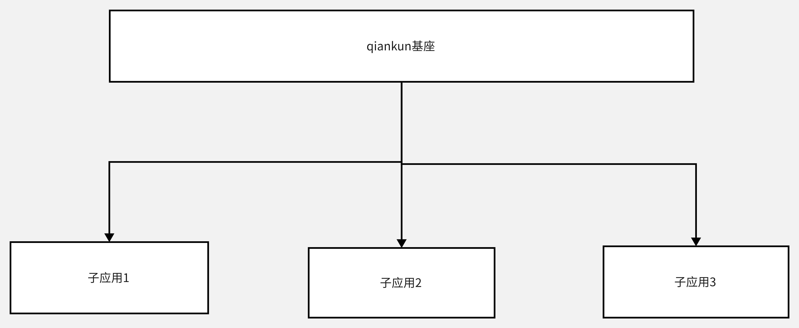
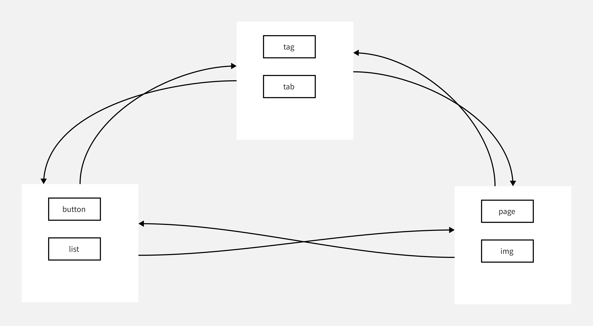
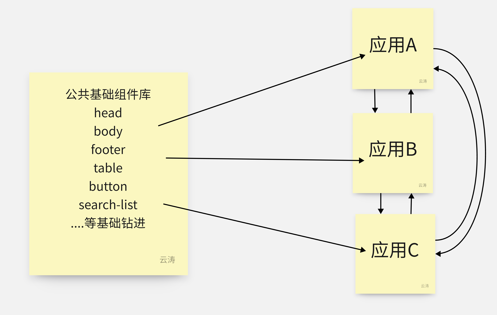

[[toc]]
### 1. 什么是微前端，解决了什么问题


::: tip
将 Web 应用从整个的「单体应用」转变为多个小型前端应用的「聚合体」。 
各个前端应用「原子化」，可以独立运行、开发、部署，从而满足业务的快速变化，以及分布式、多团队并行开发的需求
:::

### 2. 微前端优势
::: tip
- 简单、解耦、易维护
- 可独立开发、部署
- 不限技术栈
- 减少项目体积、加快响应时间
- 应用聚合
:::

### 3. 微前端现有实现实现方案
- npm包方式公共模块共享
```text
优点
1. 抽离公共组件，统一维护
2. 通过版本管理实现功能区分

缺点
1. 构建慢，npm包更新后，相关项目必须重新构建然后发步上线。
```


- UMD 方式共享模块
```text
优点
1. 通过直接引用cdn，然后直接在项目中进行使用，而且当他们发布更新时候我们也可以做到更新

缺点
1. 各包库之间容易存在冲突
```


- iframe
```text
优点
1. 提供了浏览器原生的硬隔离方案，不论是样式隔离、js 隔离这类问题统统都能被完美解决。

缺点
1. url 不同步。浏览器刷新 iframe url 状态丢失、后退前进按钮无法使用。
2. 全局上下文完全隔离，内存变量不共享。无法完美实现iframe 内外系统的通信、数据同步等需求，主应用的 cookie 要透传到根域名都不同的子应用中实现免登效果
3. 慢。每次子应用进入都是一次浏览器上下文重建、资源重新加载的过程。
```
- qiankun方案 *【重点介绍】
```text
- 优点
1. 任意技术栈的应用均可 使用/接入，不论是 React/Vue/Angular 还是其他等框架。
2. 接入微应用像使用 iframe 一样简单
3. 样式隔离、JS沙箱，确保微应用之间 全局变量/事件 不冲突。

缺点
1. 依赖统一基座
2. 相比MF不够灵活，host（消费方）,remote（提供方）必须固化，不够灵活
```

- 模块联邦（Module Federation）*【重点介绍】
```text
- 优点
1. 灵活度高，不用统一基座。既可以是host（消费方）,也可使remote（提供方）
2. 依赖共享，资源复用，减少编译体积
3. 调试方便，可以在dev、prod环境进行调试【相比 npm link 大大提升调试速度】

缺点
1. 必须依赖满足webpack5
2. Webpack 为了支持加载 remote 模块对 runtime 做了大量改造，在运行时要做的事情也因此陡然增加，可能会对我们页面的运行时性能造成负面影响。
```



### 4. qiankun方案
[qiankun 官方文档很详细直接看官方文档](https://qiankun.umijs.org/zh/guide/tutorial)
#### 注意事项
```
1. 子项目必须配置允许跨域
2. 使用webpack必须配置output，为了让主应用能正确识别微应用暴露出来的一些信息
module.exports = {
  output: {
    library: `${packageName}-[name]`,
    libraryTarget: 'umd',
    jsonpFunction: `webpackJsonp_${packageName}`,
  },
};
3. 主子项目在同一域名下，需要制定浏览器存储规则，防止相互污染
4. 子应用接入qiankun 需要 适当改动main.js逻辑
```


### 5. 模块联邦（Module Federation）
#### 模块联全称 ModuleFedrationPlugin 简称 MF 是webpack5 提供的一种插件，把多个无相互依赖、单独部署的应用合并为一个。通俗点讲，即MF提供了能在当前应用中远程加载其他服务器上应用的能力
| 字段名             | 类型      | 含义                                                                                            |
|-----------------|---------|-----------------------------------------------------------------------------------------------|
| name            | string  | 必传值，即输出的模块名，被远程引用时路径为${name}/${expose}                                                        |
| filename        | string  | 构建输出的文件名                                                                                      |
 | exposes         | object  | 被远程引用时可暴露的资源路径及其别名                                                                            |
 | remotes         | object  | 远程引用的应用名及其别名的映射，使用时以key值作为name                                                                |
| shared          | object  | 与其他应用之间可以共享的第三方依赖，使你的代码中不用重复加载同一份依赖                                                           |
| library         | object  | 可选,定义了 remote 应用如何将输出内容暴露给 host 应用。配置项的值是一个对象，如 { type: 'xxx', name: 'xxx'}                   |
| Singleton       | Boolean | 是否开启单例模式。默认值为 false，开启后remote 应用组件和 host 应用共享的依赖只加载一次，而且是两者中版本比较高的。                           | 
| requiredVersion | string  | 指定共享依赖的版本，默认值为当前应用的依赖版本。                                                                      |
| eager           | Boolean | 共享依赖在打包过程中是否被分离为 async chunk。设置为 true， 共享依赖会打包到 main、remoteEntry，不会被分离，因此当设置为true时共享依赖是没有意义的。 |


#### 配置remote(提供者)
```js
const { defineConfig } = require("@vue/cli-service");
const { ModuleFederationPlugin } = require("webpack").container;

module.exports = defineConfig({
  transpileDependencies: true,
  publicPath: "http://localhost:8090/",
  devServer: {
    port: "8090",
    // 配置允许跨域，解决热更新报错
    headers: {
      "Access-Control-Allow-Origin": "*",
      "Access-Control-Allow-Method": "GET,POST,PUT,OPTIONS",
    },
  },
  chainWebpack: (config) => {
    config
        .plugin("module-feaderation-plugin")
        .use(ModuleFederationPlugin, [
          {
            // 指定导出的容器名称
            name: "app2",
            // 打包生成的文件名称
            filename: "remoteEntry.js",
            // 导出对应的模块
            exposes: {
              "./list": "./src/components/list.vue",
            },
            // 共享
            shared: [
                'vue'
            ]
          },
        ])
        .end()
        .optimization.delete("splitChunks");
  },
});
```
#### 配置host(消费者)
```js
const { defineConfig } = require("@vue/cli-service");
const { ModuleFederationPlugin } = require("webpack").container;

module.exports = defineConfig({
    transpileDependencies: true,
    devServer: {
        port: 8080,
    },

    chainWebpack: (config) => {
        config.plugin("module-feaderation-plugin").use(ModuleFederationPlugin, [
            {
                // 指定输出的容器名称
                name: "app1",
                // 引用远程的 expose 模块
                remotes: {
                    app2: "app2@http://localhost:8090/remoteEntry.js",
                },
            },
        ]);
    },
});
```
#### host(消费者)方使用
```vue
<template>
  <div class="hello">
    <list></list>
  </div>
</template>

<script>
export default {
  name: 'HelloWorld',
  components: {
    list: () => import('app2/list')
  }
}
</script>
```

### 6. MF vs qiankun
| 方案                        | 维度  | 定义 | 技术实现 | 使用场景             |
|---------------------------|-----|---|------|------------------|
| Module Federation | 模块  | 由多个互相独立的模块聚合而成的应用 |   模块本质上是JS代码片段，这种代码片段一般称为chunk。因此，模块的聚合，实际上是chunk的聚合。   | 适用组间库开发、项目组件相互引用 |
| qiankun                   | 应用  |  由多个互相独立的应用聚合而成的应用 |   应用本质上是HTML，而在SPA中，HTML又是main.js进行填充的。因此，应用的聚合，实际上是main.js的聚合。 | 适用于多项目结合、组合项目    |

### 7. 思考引入 ModuleFederation、qiankun需要的代价 
#### qiankun
```text
1. 需要具备统一登录方案
2. 需要实现统一基座
3. 各个子应用公用浏览器缓存需要制定一套浏览器缓存方案
4. 各个子应用mian.js及router.js需要微调
```
#### MF
```text
1. 需要将webpack升级到5
2. 需要构建一套统一“消费、提供、共享依赖”规则
3. 各个子应用升级到webpack5兼容webpack3实现的功能
4. 需要以MF方案构建一个通用组件库
```

### 总结
::: tip
存在即合理，每种技术方案都有应场景，都存在优势、不足； 前端微服务实践要考虑分析现有项目的应用场景及想要实现的目标，
选择适合的技术方案，往往比最新或最优的技术方案更加实用
:::
