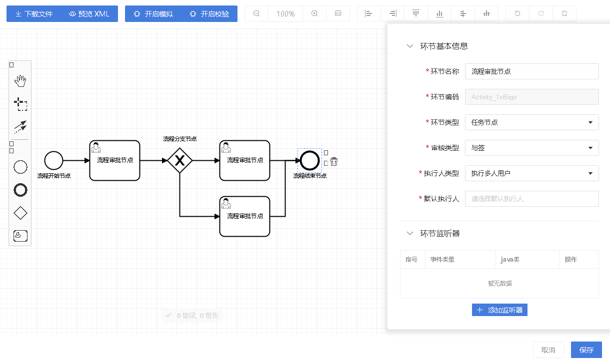
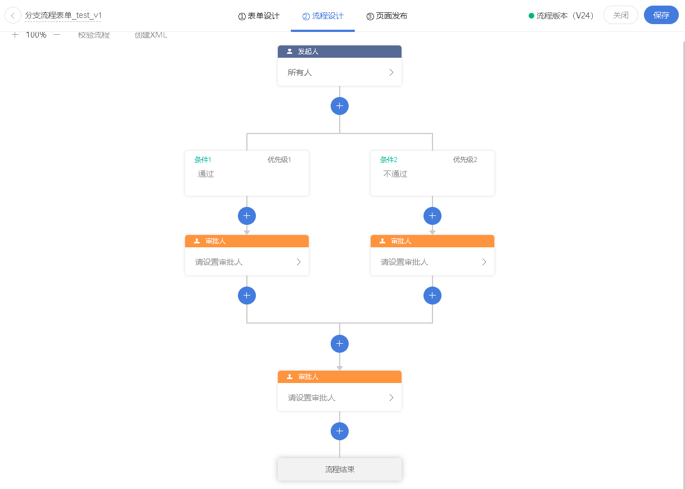
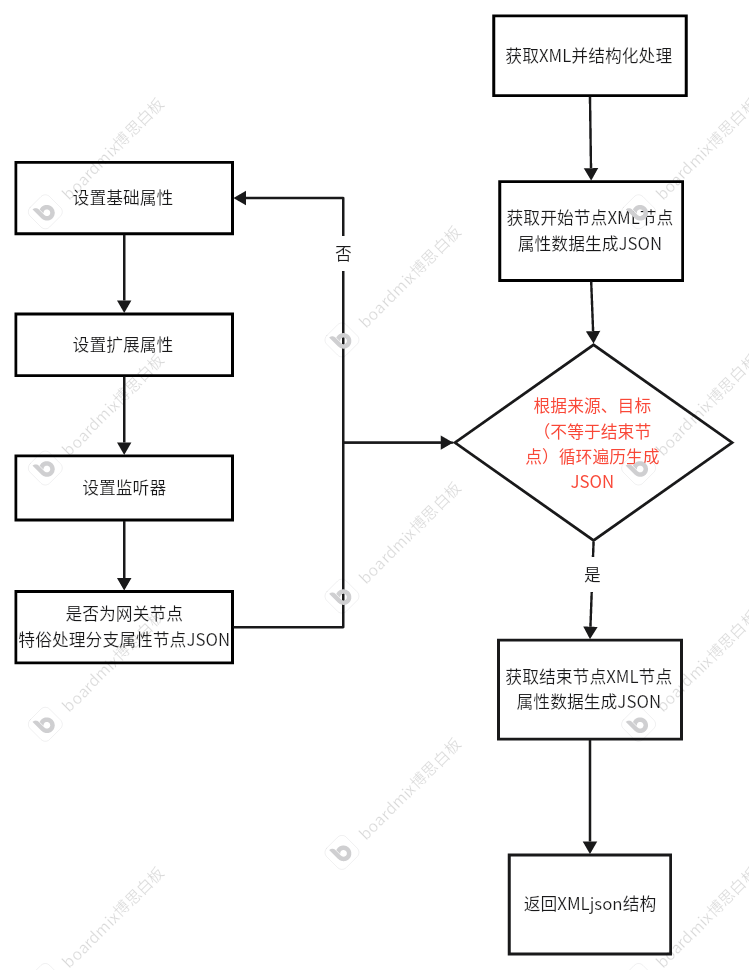
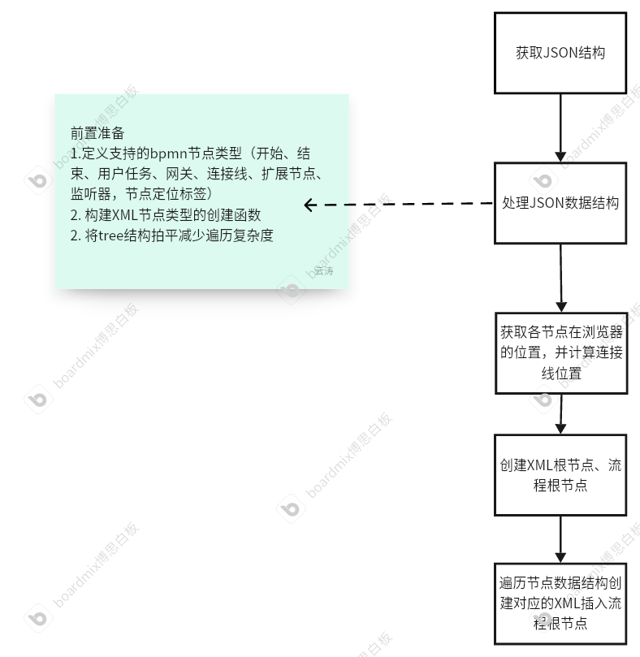

[[toc]]
### 1. 底层技术栈介绍 Bpmn + Flowable
* Bpmn: 通过使⽤用简单的图形符号将业务流程转换为可视化图形，让业务流程建模变得简单化、图形化，负责的建模过程变得可视化。
* Flowable: 是一个使用Java编写的轻量级业务流程引擎。Flowable流程引擎可用于部署BPMN 2.0流程定义（用于定义流程的行业XML标准）， 创建这些流程定义的流程实例，进行查询，访问运行中或历史的流程实例与相关数据，等等。

### 2. 选择流程配置可视化交互体验 Bpm 、类钉钉流程
| 名称      | 优势                                                     | 劣势                                                             | 图片                   |
|---------|--------------------------------------------------------|----------------------------------------------------------------|----------------------|
| Bpmn    | 1. 支持工具栏自定义配置 </br> 2. 现成sdk减少开发量 </br> 3. 可用图形配置复杂流程  | 1. 交互效果一般，操作性复杂不适与用户  </br> 2. 只能扩展配置，无法基于源码进行二开 |  |
| 类钉钉流程   | 1. 交互体验友好 </br>  2. 面向用户群比较友好  </br> 3. 交互全部自定义开发,配置灵活 | 1. 无法配置复杂流程 </br>  2. 增加前后端开发成本                                |  |

#### * 不管交互如何变化，后端技术Flowable不会变

### 3. bpmn.js XML 节点分析
#### 开始节点
```xml
<bpmn2:startEvent id="StartEvent_1" name="流程开始节点">
    <bpmn2:outgoing>Flow_10ut6rz</bpmn2:outgoing>
</bpmn2:startEvent>
```
```json
{
  "id": "start",
  "name": "流程开始",
  "pid": "null",
  "type": "START",
  "child": {}
}
```
#### 结束节点
```xml
<bpmn2:endEvent id="Event_1676yjw" name="流程结束节点">
  <bpmn2:incoming>Flow_05rq1sp</bpmn2:incoming>
</bpmn2:endEvent>
```
```json
{
  "id": "end",
  "name": "流程结束",
  "pid": "468654645",
  "type": "END",
  "child": null
}
```
#### 连接线节点
```xml
<!--普通分支线-->
<bpmn2:sequenceFlow id="Flow_10ut6rz" name="111" sourceRef="StartEvent_1" targetRef="Activity_0rk1166" />
<!--流程分支线-->
<bpmn2:sequenceFlow id="Flow_1gz8sbr" name="条件1" sourceRef="Gateway_1q6lhbp" targetRef="Activity_19o5pdl">
    <bpmn2:conditionExpression xsi:type="bpmn2:tFormalExpression">${auditResult=='passed'}</bpmn2:conditionExpression>
</bpmn2:sequenceFlow>
```
> 普通连接线在JSON结构中用 pid、child来实现连接线功能
```json
{
  "id":"node_489367075608",
  "pid":"node_489367072431",
  "type":"CONDITION",
  "name":"条件1",
  "props":{
    "conditionExpression":{
      "body":"${auditResult=='passed'}"
    }
  },
  "child": "分支后的节点接送结果-省略不展示"
}
```

#### 任务节点
```xml
<bpmn2:userTask id="Activity_0rk1166"
                name="流程审批节点"
                flowable:tag="default"
                flowable:auditType="combine"
                flowable:assignType="candidateUsers"
                flowable:variableType="">
    <bpmn2:incoming>Flow_10ut6rz</bpmn2:incoming>
    <bpmn2:outgoing>Flow_1fud33z</bpmn2:outgoing>
</bpmn2:userTask>
```
```json
{ 
  "id":"initiate",
  "name":"发起人",
  "pid":"start",
  "type":"INITIATE",
  "props":{
    "attrs":{
      "tag":"default",
      "auditType":"candidate",
      "assignType":"customVariable",
      "variableType":"preSetVariable",
      "candidateUsers":"${_creator}",
      "nodeExtend":"{}"
    },
    "executionListeners":[]
  }
}
```

#### 位置标签
```xml
<!--图形-->
<bpmndi:BPMNShape id="BPMNShape_start" bpmnElement="start">
    <dc:Bounds x="882" y="100" width="36" height="36" />
<bpmndi:BPMNLabel>
<!--连接线-->
<bpmndi:BPMNEdge id="Flow_node_078461436617_line" bpmnElement="Flow_node_078461436617">
    <di:waypoint x="900" y="336" />
    <di:waypoint x="900" y="406" />
    <bpmndi:BPMNLabel>
        <dc:Bounds x="838" y="362" width="80" height="14" />
    </bpmndi:BPMNLabel>
</bpmndi:BPMNEdge>
```
```json
{
    "x": "0",
    "y": "0", 
    "width": "80",
    "height": "80",
    "lineWidth": "184",
    "line": [
        { "x":  "0", "y": "0"},
        { "x":  "0", "y": "0"}
    ],
    "label": {
        "x":  "0",
        "y": "0",
        "width": "80",
        "height": "80"
    },
    "endPoint": {
        "x": "0",
        "y": "0"
    }
}
```

#### 监听器
```xml
<bpmn2:extensionElements>
    <flowable:executionListener class="com.thunisoft.ninelaw.ninelawflow.engine.listenerImpl.TestListener" event="executing" execute="class">
        <flowable:field name="aaa">
            <flowable:string>111</flowable:string>
        </flowable:field>
    </flowable:executionListener>
</bpmn2:extensionElements>
```
```json
{
  "executionListeners":[{
    "event":"executing",
    "execute":"class",
    "class":"com.thunisoft.ninelaw.ninelawflow.engine.listenerImpl.TestListener",
    "fields":[
      {"value":"111","key":"aaa"}
    ]
  }]
}
```

#### 网关节点
```xml
<bpmn2:exclusiveGateway id="Gateway_07v00lw" name="流程分支节点">
    <bpmn2:incoming>Flow_1stb954</bpmn2:incoming>
    <bpmn2:outgoing>Flow_0na2xfz</bpmn2:outgoing>
</bpmn2:exclusiveGateway>
```
```json
{
  "id":"node_489367072431",
  "pid":"node_281491581915",
  "clientRect":{},
  "props":{},
  "type":"CONDITIONS",
  "name":"条件分支",
  "branchs":[
    {
      "id":"node_489367075608",
      "pid":"node_489367072431",
      "type":"CONDITION",
      "props":{
        "conditionExpression":{"body":"${auditResult=='passed'}"}},
        "name":"条件1",
        "child": "分支后的节点接送结果-省略不展示"
    },
    {
      "id": "node_489367077418",
      "pid": "node_489367072431",
      "type": "CONDITION",
      "props": {
        "conditionExpression": {
          "body": "${auditResult=='notPass'}"
        }
      },
      "name": "条件2",
      "child": "分支后的节点接送结果-省略不展示"
    }
  ],
  "child":{
    "id":"end",
    "name":"流程结束",
    "pid":"node_489367072431",
    "type":"END",
    "childId":"null"
  }
}
```
### 4. 实现XML、JSON互转
#### XML转JSON
> 
#### JSON转XML
> 

### 5. 相关链接
* [Bpmn.js官网](https://bpmn.io/toolkit/bpmn-js/)
* [225-Bpmn.js-流程引擎](http://172.16.14.225:9123/processList?_channel=guild-gdsz&_tenantid=1)
* [225-无代码-流程引擎](http://172.16.14.225:9123/lowCode/processList/?_channel=guild-gdsz&_tenantid=1)

### 6. 总结
* 通过对bpmn.js二开、和实现类钉钉流程交互实现XML与JSON互转，可以说对流程引擎这一块的可以基本拿捏了
* 后续无论以那种方案进行深入开发，可以在此基础进行分扩充
* 注意1：类钉钉流程交互无法很好实现复杂的驳回连接线、区域等复杂交互实现 需要配置相关属性后端进行实现
* 注意2：XML与JSON互转需要定义、实现项目节点与属性（类钉钉流程可视化构建的JSON、XML可以互转、Bpmn.js可视化构建的XML、JSON不一定能互转）
