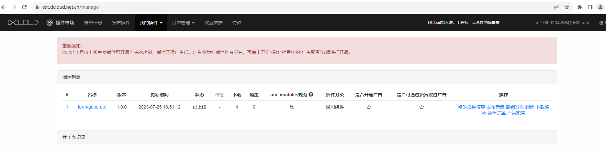
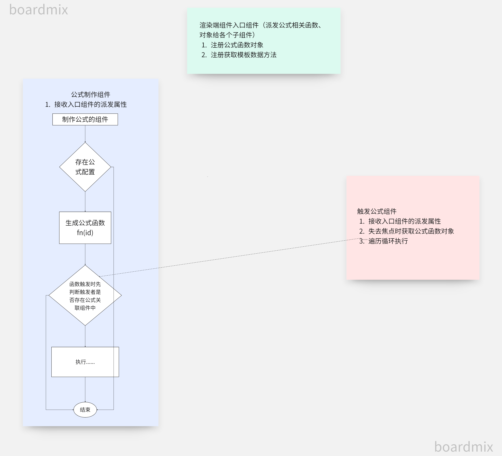

[[toc]]
### 1. 背景
::: danger
* 自定义组件在不断推广、应用中项目实际场景中，pc端兼容h5无法满足更多场景
* 需采用类似 uniApp 一套代码 生成多端项目的框架来实现 以此解决小程序、客户端等多平台应用问题
* 本篇 将以uniAPP构建自定义组件V3 SDK 方案 开讲解其 知识点
  :::

### 2. uniApp 官网推荐构建SDK能力
#### 2.1 使用官网推荐编辑器 HBuilderX 编辑器
#### 2.2 [官方文档插件介绍](https://uniapp.dcloud.net.cn/plugin/uni_modules.html#%E5%BC%80%E5%8F%91-uni-modules-%E6%8F%92%E4%BB%B6)
#### 2.3 [插件管理](https://dev.dcloud.net.cn/pages/app/list)


### 3. npm 包方式构建SDK 及 在uniApp中 如何引入
#### 3.1 构建SDK
```text
1. cd /进入当前层级目录
2. 登录公司组件库地址 npm adduser --**
3. 发布组件 npm publish --registry **
```
#### 3.2 在uniApp中引入npm
```text
1. 打开uniapp项目，在终端中输入命令npm init，创建一个package.json文件。
2. 在终端中输入命令npm install **
3. 在需要使用npm包的页面中，使用import语句引入所需的npm包。
4. 在引入npm包后，即可在页面中使用该npm包提供的功能。
```

### 4. uniApp插件市场、仓库库特点介绍
| 名称          | 特点介绍                                                                      |
|-------------|---------------------------------------------------------------------------|
| uniApp插件市场  | 1. uniApp 官网推荐方案 <br/> 2. 与HBuilder编辑器结合使用可视化发布引入插件 <br/> 3. 开源可提升开发团队知名度 |
| 公司npm仓库  | 1. 统一管理维护npm包 <br/> 2. 更适用于团队uniApp脚手架 <br/> 3. 防止源码泄露                         |

### 5. uniApp-自定义组件V3.0 API 介绍
#### Attributes
| 名称                         | 类型            | 默认值                   | 必填              | 描述             |
| ----------------------------|---------------- | ----------------------  | -----------------|------------------|
| type                        | String          | add 可选 add、viewEdit   |  false           |   表单类型        |
| isProcessForm               | Boolean         | false                   |   false          |   流程表单        |
| elements                    | Array           | []                      |   true           |   表单模版        |
| elementDataList             | Object          | {}                      |   false          |   表单数据        |
| hookFunctionObject          | Object          | {}                      |   true           |组件钩子下方详细介绍 |
| textAline                   | String          | ct-right                |   false          | 不传默认右对齐，传 ct-left 或其他字符 左对齐 |


#### Events
| 事件名称                     |  描述           |   参数  | 回调参数                  |
| ----------------------------|----------------| --------|------------------------ |
| createParams                |  获取表单数据    |    无     |{initFinished: true【初始化完成】,valid: allValid【检验结果】,value: this.submitData【提交数据】}	|

### 6. 自定义组件复杂功能设计思路
#### 6.1 注册公式设计思路

#### 6.2 控制显隐、必填设计思路

### 7. 后续计划
::: tip
1. 新增标题、利率、锚点(只实现PC)组件
2. 扩展公式计算种类
3. 配置组件动作(考虑js安全性问题)
4. 优化包体积
5. 终极目标: 一套Schema对应多个DSL(vue、uniApp) 解析生成页面源码  
:::
